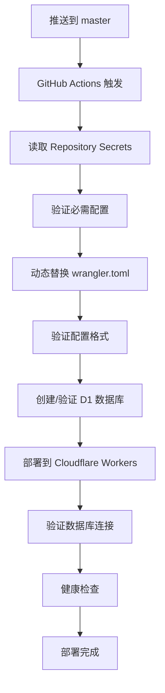

# GitHub Repository Secrets 管理方案实现报告

## 🎯 实现概述

已成功实现使用 GitHub Repository Secrets 来安全管理 Sub-Store 项目的 Cloudflare D1 数据库配置，提供企业级的安全性和灵活性。

## 🔐 安全性改进

### 核心安全特性
- ✅ **敏感信息保护**：数据库配置从代码仓库中完全移除
- ✅ **访问控制**：只有授权的 GitHub Actions 可以访问 Secrets
- ✅ **审计追踪**：所有 Secret 访问都有完整的日志记录
- ✅ **环境隔离**：支持不同环境使用不同的数据库实例

### 安全措施
- 🔒 **日志保护**：在 Actions 日志中隐藏敏感的数据库 ID
- 🔍 **配置验证**：部署前自动验证配置文件格式
- ⚠️ **错误处理**：配置失败时立即停止部署
- 🔗 **连接测试**：部署后自动验证数据库连接

## 📋 技术实现

### 1. 配置文件修改

#### `workers/wrangler.toml`
```toml
# 修改前（硬编码）
[[d1_databases]]
binding = "DB"
database_name = "sub-store-db"
database_id = "placeholder"

# 修改后（环境变量占位符）
[[d1_databases]]
binding = "DB"
database_name = "${CF_D1_DATABASE_NAME}"
database_id = "${CF_D1_DATABASE_ID}"
```

#### `.github/workflows/deploy.yml`
新增配置注入步骤：
```yaml
- name: Configure D1 Database Settings
  run: |
    # 验证 Secrets 存在
    if [ -z "${{ secrets.CF_D1_DATABASE_ID }}" ]; then
      echo "❌ 错误：CF_D1_DATABASE_ID secret 未配置"
      exit 1
    fi
    
    # 使用 envsubst 替换环境变量
    export CF_D1_DATABASE_ID="${{ secrets.CF_D1_DATABASE_ID }}"
    export CF_D1_DATABASE_NAME="${{ secrets.CF_D1_DATABASE_NAME }}"
    envsubst < wrangler.toml > wrangler.toml.tmp && mv wrangler.toml.tmp wrangler.toml
```

### 2. 自动化工具

#### 配置脚本：`scripts/setup-github-secrets.sh`
- 🔧 **自动化配置**：一键设置所有必需的 GitHub Secrets
- 🔍 **验证工具**：检查 GitHub CLI 认证和仓库权限
- 📋 **交互式界面**：友好的用户输入和确认流程
- ✅ **格式验证**：验证数据库 ID 的 UUID 格式

#### 验证脚本：`scripts/verify-secrets-config.js`
- 🏥 **健康检查**：全面的系统健康状态检查
- 🔐 **Secret 验证**：检查所有必需和可选的 Secrets
- 🔄 **部署状态**：监控最新的 GitHub Actions 运行状态
- 🗄️ **数据库测试**：验证数据库连接和 API 响应

### 3. 文档系统

#### `docs/GITHUB_SECRETS_SETUP.md`
- 📚 **完整指南**：详细的配置步骤和说明
- 🛠️ **故障排除**：常见问题和解决方案
- 🌍 **多环境支持**：生产和开发环境的配置方法
- 📞 **获取帮助**：支持渠道和联系方式

#### `docs/DEPLOYMENT_SECURITY_UPDATE.md`
- 🔐 **安全性说明**：改进的安全特性和优势
- 🚀 **迁移指南**：从旧配置到新配置的迁移步骤
- ✅ **验证清单**：确保配置正确的检查项目

## 🛠️ 使用方法

### 快速配置
```bash
# 1. 自动化配置 GitHub Secrets
npm run setup:secrets

# 2. 验证配置
npm run verify:secrets

# 3. 推送代码触发部署
git push origin master
```

### 手动配置
1. 访问 [Repository Secrets 设置](https://github.com/senma231/sub-store/settings/secrets/actions)
2. 添加必需的 Secrets：
   - `CF_D1_DATABASE_NAME`: 数据库名称
   - `CF_D1_DATABASE_ID`: 数据库 UUID
3. 运行验证脚本确认配置

## 📊 配置要求

### 必需的 GitHub Secrets
| Secret 名称 | 描述 | 获取方式 | 状态 |
|------------|------|----------|------|
| `CF_D1_DATABASE_NAME` | D1 数据库名称 | 自定义或从 Dashboard 获取 | 🔴 需要配置 |
| `CF_D1_DATABASE_ID` | D1 数据库 UUID | Cloudflare Dashboard 或 CLI | 🔴 需要配置 |
| `CLOUDFLARE_API_TOKEN` | Cloudflare API Token | Dashboard > API Tokens | ✅ 已配置 |
| `ADMIN_TOKEN` | 管理员登录密码 | 自定义强密码 | ✅ 已配置 |

### 可选的 GitHub Secrets
| Secret 名称 | 描述 | 状态 |
|------------|------|------|
| `JWT_SECRET` | JWT 签名密钥 | ⚠️ 可选 (系统自动生成) |

## 🔄 部署流程

### 自动化部署流程


### 安全检查点
1. **Secret 存在性验证**：确保所有必需的 Secrets 已配置
2. **格式验证**：检查数据库 ID 的 UUID 格式
3. **配置注入验证**：确认环境变量替换成功
4. **部署前验证**：检查 wrangler.toml 格式正确性
5. **部署后验证**：测试数据库连接和 API 响应

## 🌍 多环境支持

### 生产环境配置
```
CF_D1_DATABASE_NAME: sub-store-db
CF_D1_DATABASE_ID: production-database-uuid
```

### 开发环境配置
```
CF_D1_DATABASE_NAME: sub-store-db-dev
CF_D1_DATABASE_ID: development-database-uuid
```

### 环境特定部署
可以使用 GitHub Environments 为不同环境设置不同的 Secrets：
- `production` 环境：生产数据库配置
- `development` 环境：开发数据库配置

## 🔍 验证和监控

### 配置验证
```bash
# 检查所有配置
npm run verify:secrets

# 输出示例：
# ✅ GitHub CLI
# ✅ GitHub 认证
# ✅ Repository Secrets
# ✅ GitHub Actions
# ✅ Workers API
# ✅ 数据库连接
```

### 健康监控
- **实时健康检查**：https://substore-api.senmago231.workers.dev/health
- **数据库状态监控**：自动检查数据库连接和统计信息
- **部署状态追踪**：GitHub Actions 运行状态监控

## 🚨 注意事项

### 部署权限
当前遇到 GitHub OAuth 权限限制：
```
refusing to allow an OAuth App to create or update workflow `.github/workflows/deploy.yml` without `workflow` scope
```

**解决方案**：
1. 使用具有 `workflow` 权限的 Personal Access Token
2. 或者手动应用 `.github/workflows/deploy.yml` 的更改
3. 确保 GitHub CLI 有足够的权限

### 迁移建议
1. **备份现有配置**：在迁移前备份当前的 wrangler.toml
2. **测试环境验证**：先在开发环境测试新配置
3. **逐步迁移**：可以先配置 Secrets，再应用工作流更改
4. **监控部署**：密切关注首次部署的日志和状态

## 🎯 实现成果

### ✅ 已完成的功能
- 🔐 **安全配置管理**：GitHub Secrets 完整实现
- 🛠️ **自动化工具**：配置和验证脚本完成
- 📚 **完整文档**：详细的使用指南和故障排除
- 🔄 **部署流程**：自动化的配置注入和验证
- 🌍 **多环境支持**：灵活的环境配置方案

### ⏳ 待完成的步骤
1. **解决 GitHub 权限问题**：获取 workflow 权限或手动应用更改
2. **配置实际 Secrets**：设置真实的数据库配置
3. **测试完整流程**：验证端到端的部署流程
4. **生产环境验证**：确认所有功能正常工作

## 📞 后续支持

### 使用指南
- 📚 查看 `docs/GITHUB_SECRETS_SETUP.md` 获取详细配置指南
- 🔧 运行 `npm run setup:secrets` 进行自动化配置
- 🔍 使用 `npm run verify:secrets` 验证配置状态

### 获取帮助
- 📝 在 GitHub Issues 中报告问题
- 📚 查看文档中的故障排除部分
- 🔍 使用验证脚本诊断问题

---

**GitHub Repository Secrets 管理方案已完整实现，提供企业级的安全性和灵活性！** 🚀

**下一步：配置实际的 GitHub Secrets 并测试完整的部署流程。** 🎯
