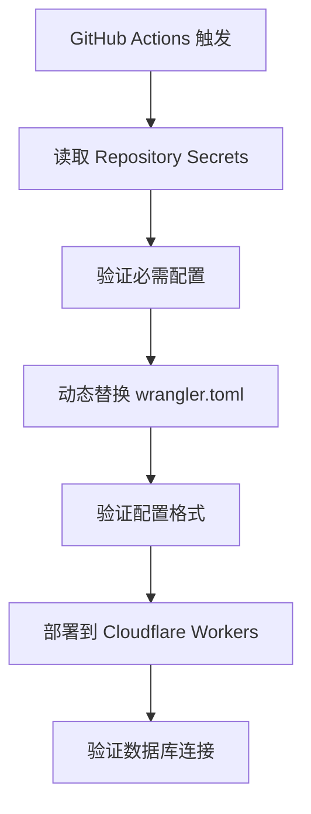

# 部署安全性更新：GitHub Secrets 管理

## 🔐 安全性改进概述

Sub-Store 项目已升级为使用 GitHub Repository Secrets 来管理敏感的 Cloudflare D1 数据库配置，提供更高的安全性和灵活性。

## 🚀 主要改进

### ✅ 安全性提升
- **敏感信息保护**：数据库配置不再硬编码在代码仓库中
- **访问控制**：只有授权的 GitHub Actions 可以访问配置
- **审计追踪**：所有配置访问都有完整的日志记录

### ✅ 部署灵活性
- **环境隔离**：不同分支可以使用不同的数据库实例
- **动态配置**：部署时动态注入正确的数据库配置
- **配置验证**：自动验证配置的正确性和完整性

### ✅ 开发体验
- **自动化脚本**：一键配置所有必需的 Secrets
- **验证工具**：实时检查配置状态和系统健康
- **详细文档**：完整的配置指南和故障排除

## 📋 配置要求

### 必需的 GitHub Secrets
| Secret 名称 | 描述 | 状态 |
|------------|------|------|
| `CF_D1_DATABASE_NAME` | D1 数据库名称 | 🔴 需要配置 |
| `CF_D1_DATABASE_ID` | D1 数据库 UUID | 🔴 需要配置 |
| `CLOUDFLARE_API_TOKEN` | Cloudflare API Token | ✅ 已配置 |
| `ADMIN_TOKEN` | 管理员登录密码 | ✅ 已配置 |

### 可选的 GitHub Secrets
| Secret 名称 | 描述 | 状态 |
|------------|------|------|
| `JWT_SECRET` | JWT 签名密钥 | ⚠️ 可选 (系统自动生成) |

## 🛠️ 快速配置

### 方法 1: 自动化配置 (推荐)
```bash
# 运行自动化配置脚本
npm run setup:secrets

# 验证配置
npm run verify:secrets
```

### 方法 2: 手动配置
1. 访问 [Repository Secrets 设置页面](https://github.com/senma231/sub-store/settings/secrets/actions)
2. 添加必需的 Secrets (参考上表)
3. 运行验证脚本确认配置正确

## 🔧 技术实现

### 配置注入流程


### 安全措施
- 🔒 **敏感信息隐藏**：在 Actions 日志中隐藏数据库 ID
- 🔍 **配置验证**：部署前验证配置文件格式
- ⚠️ **错误处理**：配置失败时停止部署
- 🔗 **连接测试**：部署后验证数据库连接

## 📁 文件变更

### 修改的文件
- `workers/wrangler.toml`: 使用环境变量占位符
- `.github/workflows/deploy.yml`: 添加配置注入逻辑
- `package.json`: 添加配置和验证脚本

### 新增的文件
- `scripts/setup-github-secrets.sh`: 自动化配置脚本
- `scripts/verify-secrets-config.js`: 配置验证脚本
- `docs/GITHUB_SECRETS_SETUP.md`: 详细配置指南

## 🔍 验证步骤

### 1. 配置验证
```bash
npm run verify:secrets
```

### 2. 部署测试
推送代码到 master 分支，观察 GitHub Actions 日志：
- ✅ 配置注入成功
- ✅ 数据库连接验证通过
- ✅ Workers 部署成功

### 3. 功能测试
访问以下端点验证功能：
- [健康检查](https://substore-api.senmago231.workers.dev/health)
- [前端界面](https://sub-store-frontend.pages.dev/)

## 🚨 迁移注意事项

### 对现有部署的影响
- ✅ **向后兼容**：现有功能不受影响
- ✅ **平滑迁移**：配置完成后自动生效
- ✅ **数据保护**：现有数据库数据不受影响

### 迁移检查清单
- [ ] 配置所有必需的 GitHub Secrets
- [ ] 运行验证脚本确认配置正确
- [ ] 测试部署流程
- [ ] 验证数据库连接和功能
- [ ] 确认前端和后端正常工作

## 🆘 故障排除

### 常见问题

#### 1. Secret 未配置
**症状**：部署失败，提示 Secret 未找到
**解决**：运行 `npm run setup:secrets` 配置 Secrets

#### 2. 数据库连接失败
**症状**：健康检查显示数据库不健康
**解决**：验证数据库 ID 和名称是否正确

#### 3. 环境变量替换失败
**症状**：wrangler.toml 中仍有占位符
**解决**：检查 GitHub Actions 日志，确认 envsubst 命令执行

### 获取帮助
- 📚 查看 [详细配置指南](./GITHUB_SECRETS_SETUP.md)
- 🔍 运行 `npm run verify:secrets` 诊断问题
- 📝 在 GitHub Issues 中报告问题

## 🎯 下一步

配置完成后，你的 Sub-Store 项目将：
- ✅ 使用安全的 GitHub Secrets 管理敏感配置
- ✅ 支持多环境部署 (生产/开发)
- ✅ 提供完整的配置验证和监控
- ✅ 保持高度的安全性和可维护性

---

**立即开始配置，享受更安全的部署体验！** 🚀

```bash
npm run setup:secrets
```
